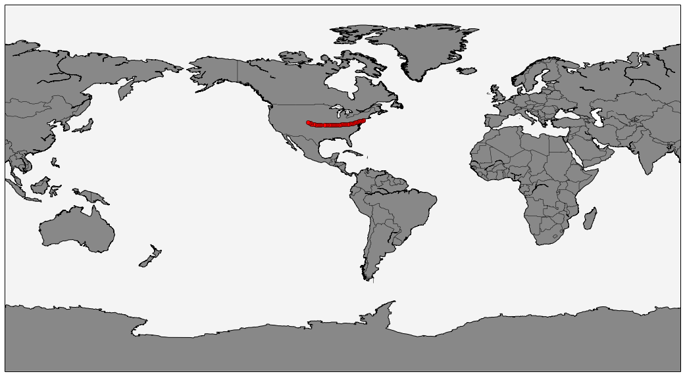

    # Import pandas
    import pandas as pd
    
    # Import matplotlib and Basemap
    import matplotlib.pyplot as plt
    from mpl_toolkits.basemap import Basemap
    
    # Set iPython to display visualization inline
    %matplotlib inline

    inCSV = 'jetblue-gps.csv'
    
    df = pd.read_csv(inCSV, header=None)
    
    df.columns = ['lat_work','lng_work','drop']
    
    df['latitude'] = df['lat_work'].str.replace('(','').str.replace('new google.maps.LatLng','')
    df['longitude'] = df['lng_work'].str.replace(')','')
    
    df['latitude'] = df['latitude'].astype(float)
    df['longitude'] = df['longitude'].astype(float)
    
    df = df[['latitude','longitude']]
    
    df.head(5)

<table border="1" class="dataframe">
  <thead>
    <tr style="text-align: right;">
      <th></th>
      <th>latitude</th>
      <th>longitude</th>
    </tr>
  </thead>
  <tbody>
    <tr>
      <th>0</th>
      <td> 40.472603</td>
      <td>-74.006310</td>
    </tr>
    <tr>
      <th>1</th>
      <td> 40.348148</td>
      <td>-74.177799</td>
    </tr>
    <tr>
      <th>2</th>
      <td> 40.167046</td>
      <td>-74.771404</td>
    </tr>
    <tr>
      <th>3</th>
      <td> 40.107994</td>
      <td>-75.466461</td>
    </tr>
    <tr>
      <th>4</th>
      <td> 39.916077</td>
      <td>-76.197224</td>
    </tr>
  </tbody>
</table>

    # Create a figure of size (i.e. pretty big)
    fig = plt.figure(figsize=(20,10))
    
    # Create a map, using the Gall–Peters projection, 
    map = Basemap(projection='gall',
                  # with low resolution,
                  resolution = 'l',
                  # And threshold 100000
                  area_thresh = 100000.0,
                  # Centered at 0,0 (i.e null island)
                  lat_0=35, lon_0=-85)
    
    # Draw the coastlines on the map
    map.drawcoastlines()
    
    # Draw country borders on the map
    map.drawcountries()
    
    # Fill the land with grey
    map.fillcontinents(color = '#888888')
    
    # Draw the map boundaries
    map.drawmapboundary(fill_color='#f4f4f4')
    
    # Define our longitude and latitude points
    # We have to use .values because of a wierd bug when passing pandas data
    # to basemap.
    x,y = map(df['longitude'].values, df['latitude'].values)
    
    # Plot them using round markers of size 6
    map.plot(x, y, 'ro', markersize=6)
    
    # Show the map
    plt.show()

